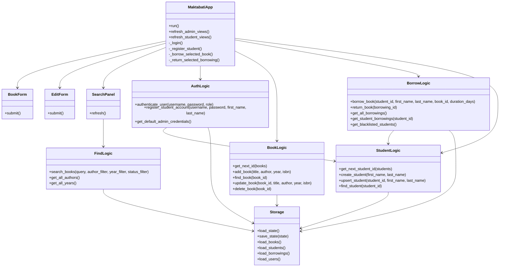
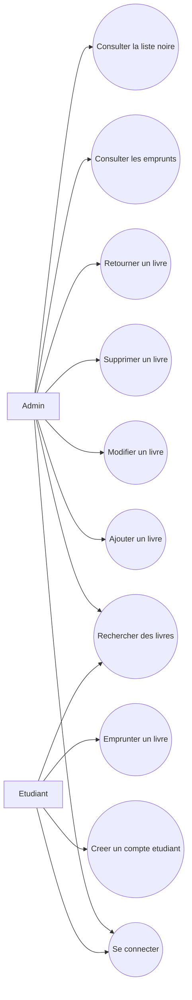
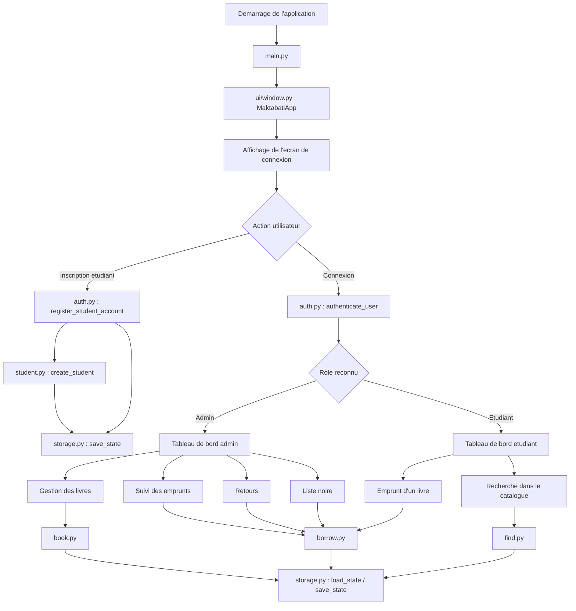
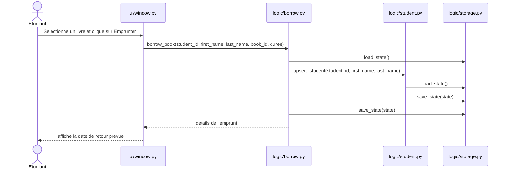

# Maktabati

Application desktop `Tkinter` de gestion de bibliotheque avec deux roles :

- `Admin` : gestion des livres, suivi des emprunts, validation des retours et consultation de la liste noire.
- `Etudiant` : consultation du catalogue, creation de compte, consultation du profil et emprunt de livres.

## Fonctionnalites

- ajout, modification et suppression de livres
- recherche et filtres sur le catalogue
- creation de comptes etudiants
- generation automatique des identifiants
- emprunt de livres avec duree configurable
- suivi des dates d'emprunt, de retour prevu et de retour effectif
- liste noire automatique pour les etudiants en retard
- persistance locale des donnees en JSON

## Architecture du projet

```text
book_manager_projet_orad/
|- main.py
|- data/
|  `- books.json
|- logic/
|  |- auth.py
|  |- book.py
|  |- borrow.py
|  |- find.py
|  |- storage.py
|  `- student.py
|- ui/
|  |- window.py
|  |- form.py
|  |- edit_form.py
|  `- search.py
`- tests
```

## UML - Diagramme de classes



## UML - Diagramme de cas d'utilisation



## Diagramme du pipeline de fonctionnement



## Diagramme de sequence - Emprunt d'un livre



## Structure JSON

Les donnees sont stockees dans [data/books.json](/c:/Users/kouss/coding/book_manager_projet_orad/data/books.json) avec cette structure :

```json
{
    "books": [],
    "students": [],
    "borrowings": [],
    "users": []
}
```

### `books`

```json
{
    "id": "1",
    "title": "Python 101",
    "author": "John Doe",
    "year": 2024,
    "isbn": "978-0000000000",
    "status": "available"
}
```

### `students`

```json
{
    "student_id": "1",
    "first_name": "Aya",
    "last_name": "Benali",
    "borrowed_book_ids": ["1", "4"]
}
```

### `borrowings`

```json
{
    "id": "1",
    "student_id": "1",
    "book_id": "4",
    "borrow_date": "2026-05-18",
    "due_date": "2026-06-01",
    "returned_date": "",
    "status": "borrowed"
}
```

### `users`

```json
{
    "username": "aya",
    "password": "1234",
    "role": "student",
    "student_id": "1",
    "first_name": "Aya",
    "last_name": "Benali"
}
```

## Lancer l'application

```bash
python main.py
```

## Version executable

Une version Windows executable est deja generee dans :

- [dist/main.exe](/c:/Users/kouss/coding/book_manager_projet_orad/dist/main.exe)

### Executer l'application

Depuis l'explorateur Windows :

- ouvrir le dossier `dist`
- double-cliquer sur `main.exe`

Depuis le terminal :

```powershell
.\dist\main.exe
```

### Regenerer le fichier `.exe`

Le projet contient deja le fichier de configuration [main.spec](/c:/Users/kouss/coding/book_manager_projet_orad/main.spec:1).

Si `PyInstaller` est installe, la commande de generation est :

```bash
pyinstaller main.spec
```

Le fichier genere sera ensuite disponible dans :

- `dist/main.exe`

### Donnees utilisees par l'executable

L'executable embarque aussi le fichier de donnees :

- [data/books.json](/c:/Users/kouss/coding/book_manager_projet_orad/data/books.json)

Le fichier `main.spec` inclut deja cette ressource :

```python
datas=[('data/books.json', 'data')]
```

## Tests

Fichiers de tests disponibles :

- [test_auth.py](/c:/Users/kouss/coding/book_manager_projet_orad/test_auth.py)
- [test_borrow.py](/c:/Users/kouss/coding/book_manager_projet_orad/test_borrow.py)
- [test_delete.py](/c:/Users/kouss/coding/book_manager_projet_orad/test_delete.py)
- [test_edit.py](/c:/Users/kouss/coding/book_manager_projet_orad/test_edit.py)
- [test_student.py](/c:/Users/kouss/coding/book_manager_projet_orad/test_student.py)

Compilation verifiee avec :

```bash
python -m py_compile main.py logic\storage.py logic\book.py logic\borrow.py logic\student.py logic\find.py logic\auth.py ui\window.py ui\form.py ui\edit_form.py ui\search.py test_auth.py test_borrow.py test_delete.py test_edit.py test_student.py
```

`pytest` n'etait pas installe dans l'environnement au moment de la verification.
